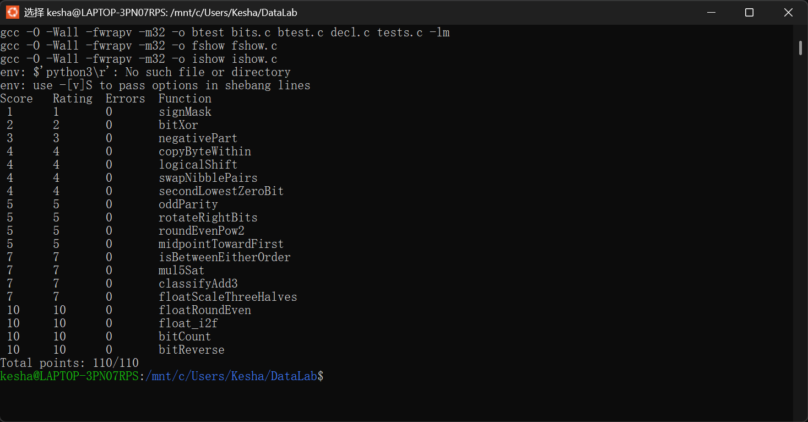

# Lab1：DataLab 实验报告

**姓名**：高诗杰

**学号**：25803050096
。
## 一、运行结果

在支持 32 位编译的 x86-64 Linux 环境中依次执行：

```
make clean && make all
./check_ops.py bits.c
./btest
```

运行结果截图如下：



## 二、各题实现思路

**P1 signMask**：返回最高位为 1 的掩码，直接用 `1 << 31` 把 1 移到符号位即可。

**P2 bitXor**：由恒等式 `x ^ y = (x | y) & ~(x & y)` 出发，再用德摩根律把 `|` 换成 `~(~x & ~y)`，全程只用 `~` 和 `&`。

**P3 negativePart**：`x >> 31` 在负数时是 32 个 1、非负时是 32 个 0，正好作掩码；`~x + 1` 即 `-x`；两者相与即可在负数时返回 `-x`、否则返回 0。

**P4 copyByteWithin**：三步完成——先取出源字节，再造一个"目标字节清零"的掩码，最后把源字节左移到目标位置与清空后的 x 相或。

**P5 logicalShift**：算术右移 `x >> n` 会把符号位拖进高 n 位，所以右移后再与掩码 `~(((1 << 31) >> n) << 1)` 清掉这些位。

**P6 swapNibblePairs**：拼出掩码 `0x0F0F0F0F`，用 `((x & m) << 4) | ((x >> 4) & m)` 交换每个字节的高、低半字节。

**P7 secondLowestZeroBit**：把问题转化为求 `~x` 中第二低的 1：先用 `z & (z + ~0)` 清掉最低的 1，再用 `y & (~y + 1)` 取出新的最低位 1；不足两位时自然得到 0。

**P8 oddParity**：把 32 位按 16、8、4、2、1 逐级折半异或，把所有位的奇偶性压到最低位；题目要求 1 的个数为偶数时返回 1，所以最后取 `(v & 1) ^ 1`。

**P9 rotateRightBits**：先把 n 对 32 取模；右半部分算术右移会补符号位，需先用掩码清掉高 k 位，再与左移部分 `x << (32 - k)` 相或。

**P10 roundEvenPow2**：加一个 bias `(2^(n-1) - 1 + 商的奇偶)`，再截断低 n 位。这个 bias 使进位恰好在"余数过半"或"正好半程且商为奇数"时发生，从而实现向偶数商舍入。

**P11 midpointTowardFirst**：`(x & y) + ((x ^ y) >> 1)` 是不溢出地求 `floor((x+y)/2)`；当和为奇数且 `x > y` 时再加 1。判断 `x > y` 需防减法溢出：同号看差值符号、异号看 x 的符号。

**P12 isBetweenEitherOrder**：x 落在区间内等价于"既不严格大于两个端点，也不严格小于两个端点"。安全的小于判断用 `d ^ ((x ^ a) & (x ^ d))` 的符号位（可自动修正减法溢出），不等号用 `u | (~u + 1)` 的最高位判断。

**P13 mul5Sat**：`5x = (x << 2) + x`。溢出分两类：左移丢位（`x >> 29` 既不是 0 也不是 -1）与同号相加变号；任一溢出就用符号位选 `INT_MAX` 或 `INT_MIN`，再用掩码在计算值与饱和值间二选一。

**P14 classifyAdd3**：逐步相加 `x+y`、`+z`，每一步记录溢出方向（正 +1、负 -1）；真实总和等于回绕和加净溢出次数 ×2^32，故只看净次数即可分类。

**P15 floatScaleThreeHalves**：把数统一写成 `M × 2^e`，求 `3M/2` 时对半程向偶数舍入；结果超过 2^24 再右移归一化并阶码 +1。最后按 M 的最高位位置归一化出尾数和阶码，NaN 与 ±0 单独处理。

**P16 floatRoundEven**：按阶码分区间处理——`E >= 23` 已是整数直接返回；`E = -1` 时只有正好 0.5 才舍到 0；`E < -1` 或 `exp = 0` 返回 ±0；否则取整数部分、依据半位与剩余位决定是否进位，进位到纯 2 的幂时阶码 +1。

**P17 float_i2f**：取符号与绝对值，找到最高位位置；保留 24 位有效数，用 `rest + half - 1 + (guard & 1)` 是否进位一次性实现向偶数舍入，进位到 2^24 时右移一位、阶码 +1。

**P18 bitCount**：分治计数——依次用 `0x55555555`、`0x33333333`、`0x0F0F0F0F` 把每 2、4、8 位的 1 的个数合并起来，最后整体相加并 `& 0x3F`。

**P19 bitReverse**：分治交换 16、8、4、2、1 位块。掩码用链式异或构造（`m4 = m8 ^ (m8 << 4)` 等）以省操作数；交换 16 位块时必须与 `0xFFFF` 掩码，因为算术右移会把符号位拖进低半部分。

## 三、参考资料

- 《深入理解计算机系统》（CS:APP）第 2、3 章

## 四、实验感受

本次实验让我对补码、算术右移与逻辑右移的区别、加减法溢出判定以及 IEEE 754 的舍入规则有了更直观的认识。在"不能使用减法、比较和控制流"的约束下构造位运算，锻炼了从比特层面思考问题的能力。

## 五、对助教的建议

实验文档已经写得很详细，若能再补充一些关于浮点题舍入边界的测试样例会更好。
